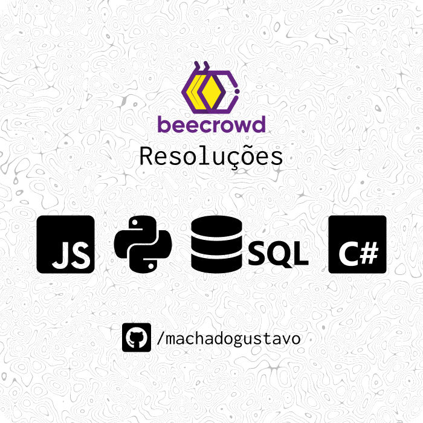
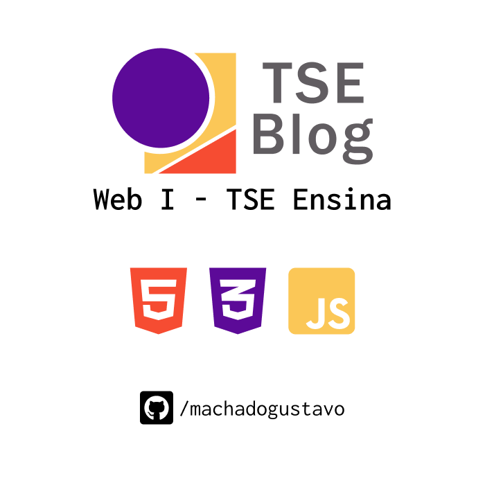

<!--"Hero"-->


<div align="center">

</div>

<header align="center">

<div align="left">

<div align="center">

## Gustavo Machado

<h6>designer and developer️</h6>

```

Front-End, Back-end, GameDev, UI Design;
Técnico Informática IFPA;
S.I UNIFESSPA;

```

<div>

</div>


</header>

<main>
<h1 style="font-size: 32px;
  font-weight: bold;">Hard-Skills</h1>
<!--"Languages, Frameworks and Tools:"-->
<h4 style="font-size: 12px;
  margin-top: 6px;">Linguagens, Frameworks & Bibliotecas</h4>


</main>  

<!--"Projects"-->
<!--"<details>"-->
<div id="projects" style="margin-top: 24px;" align="center">

<h1 style="text-align: center;
  font-size: 32px;
  font-weight: bold;
  margin-bottom: 12px;">Projetos</h1>

<div align="center">
<table>
<tr>

<td width="50%" style="border: 1px solid black;">
<h3 align="center" style="margin: 12px 0 16px 0;
  font-size: 18px;
  font-weight: bold;">Beecrowd Resolvidos</h3>
<div align="center">
<a href="https://github.com/machadogustavo/BeecrowdGustavo" target="_blank"></a>
<p>
<a href="https://github.com/machadogustavo/BeecrowdGustavo">


</a>
</a>
</p>
<p><strong>Javascript, Python, C#, SQL</strong>

Resoluções de alguns desafios do
[Beecrowd](https://www.beecrowd.com.br/judge/pt/categories)
para Web I e estudo.</p>
</div>

</td>

<td width="50%" style="border: 1px solid black;">
<h3 align="center" style="margin: 12px 0 16px 0;
  font-size: 18px;
  font-weight: bold;">UNIFESSPA Web I - Blog TSE</h3>
<div align="center">
<a href="https://github.com/machadogustavo/WebIProjetoFinal-TSE" target="_blank"></a>
<p>
<a href="https://github.com/machadogustavo/WebIProjetoFinal-TSE">

</a>
<a href="https://machadogustavo.github.io/WebIProjetoFinal-TSE/">

</a>


</a>
</p>
<p><strong>HTML, CSS, JavaScript, Figma</strong>

<strong>UI Design + Blog + Quiz + Adivinha a Palavra</strong><br>

[](https://github.com/machadogustavo)
[](https://github.com/gabrielmorandi)
<br>
</div>
</td>
</tr>

<tr>

<td width="50%" colspan="0" align="center" style="border: 1px solid black;">
<h3 align="center" style="margin: 12px 0 16px 0;
  font-size: 18px;
  font-weight: bold;">UNIFESSPA Computação Gráfica - Sword of Fates</h3>
<div align="center">
<a href="https://github.com/machadogustavo/ComputacaoGraficaProjeto-SOF" target="_blank"></a>
<p>
<a href="https://github.com/machadogustavo/ComputacaoGraficaProjeto-SOF">


</a>
</a>
</p>
<p><strong>Godot Engine, Blender</strong>

Desenvolvimento de um jogo na Godot.<br>
<strong>GameDev + Modelagem</strong><br>

[](https://github.com/machadogustavo)
[](https://github.com/AndreJoas)
[](https://github.com/wemy-nunes)

<br>
</div>
</td>

<td width="50%" colspan="0" align="center" style="border: 1px solid black;">
<h3 align="center" style="margin: 12px 0 16px 0;
  font-size: 18px;
  font-weight: bold;">UNIFESSPA Web II - Site Print Storage + API REST</h3>
<div align="center">
<a href="https://github.com/machadogustavo/WebII-ProjetoFinal" target="_blank"></a>
<p>
<a href="https://github.com/machadogustavo/WebII-ProjetoFinal">


</a>
</a>
</p>
<p><strong>React, Node.js, JavaScript, MongoDB, Figma</strong>

Projeto Final Disciplina Web II - API Print Storage<br>
<strong>UI Design + API REST + Site</strong><br>

[](https://github.com/machadogustavo)
[](https://github.com/gabrielmorandi)

<br>
</div>
</td>

</tr>
</table>
</div>
<!--"</details>"-->

<div id="github" align="center" style="margin: 12px;
  gap: 24px;
  margin-top: 24px;
  margin-bottom: 24px;">
<h1 style="font-size: 32px;
  font-weight: bold;
  margin-bottom: 24px;">GitHub Stats</h1>

  <a href="https://github.com/machadogustavo">
  
  

</div>

<!--"Social Media | Contact"-->
<footer style="display: flex;
  flex-direction: column;
  align-items: center;">
<h2 style="color: white;
  font-size: 24px;
  font-weight: bold;
  margin-bottom: 12px;">Contact me :)</h2>

[](https://www.linkedin.com/in/paixaogustavo/) [](mailto:contact.gustavomachado@gmail.com) [](https://machadogustavo.github.io/machadogustavo/)

</footer>

</div>
